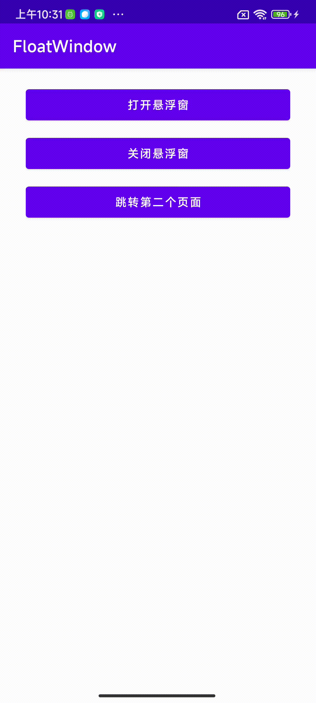

# FloatWindow

### 应用内悬浮窗，无需悬浮窗权限，业务代码侵入为0

### 效果预览


### 添加依赖
```grovy
allprojects {
  repositories {
    ...
    maven { url 'https://jitpack.io' }
  }
}
```
```grovy
dependencies {
  implementation 'com.github.limbowangqi:FloatWindow:1.0.0'
}
```

### 初始化
```kotlin
FloatWindow.init()
    .setContentView(LayoutInflater.from(this).inflate(R.layout.view_float_window, null))
    .setDraggable(MovingDraggable())
    .setAbsoluteXY(100,100)
```

### 使用
```kotlin
// 展示
FloatWindow.getInstance().show(this)
// 隐藏
FloatWindow.getInstance().hide()
```

### 属性介绍
| 属性                    |说明       |
|:-----------------------|:-------------------------------------------------------|
| setContentView(view: View)  | 设置悬浮窗布局 |
| setGravity(gravity: Int)   | 设置相对屏幕的位置 |
| setAbsoluteXY(x: Int, y: Int) | 设置在屏幕上的绝对位置 x、y坐标 |
| setBackgroundDimAmount(amount: Float) | 设置背景透明度 （0-1）|
| setOutsideTouchable(touchable: Boolean)| 设置外部是否可点击 |
| setDraggable(draggable: BaseDraggable) | 设置滑动模式 |

